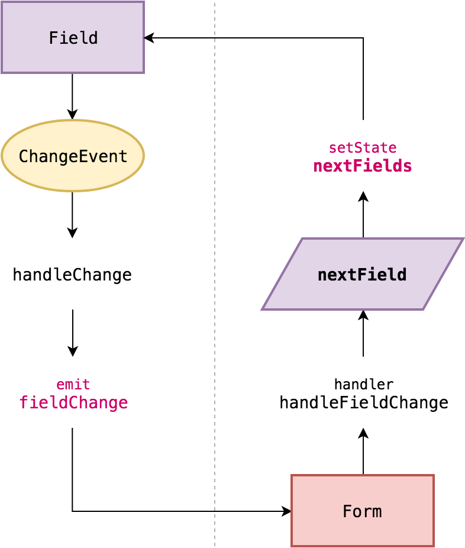
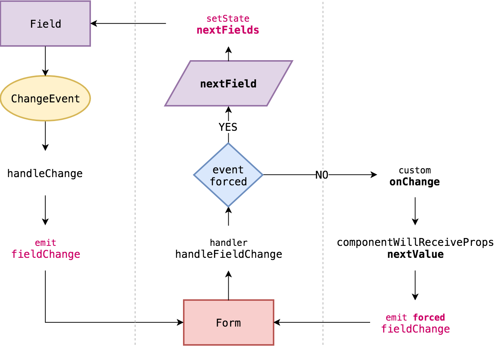

# Controlled fields

We do not encourage [controlled fields](https://reactjs.org/docs/forms.html#controlled-components).

## Why favor uncontrolled?

Making something controlled comes with the expense of maintaining it. The more things you maintain, the more responsibility is delegated to your logic. This delegation is often unnecessary. Pay for what benefits you.

Most of the time people make fields controlled in order to access their value or state during certain form events \(validation, serialization, submit\). React Advanced Form is aware of those scenarios and exposes you a field's value and its entire state in the parameters of **all** form callback methods.


Of course, it is your decision and we allow to have controlled fields, because it may be necessary in certain situations.


## Internals

All fields are controlled by default in the state model of React Advanced Form. We believe this is the responsibility of a form, and this is what the form is doing.

### Default update model



### Custom update model



## Example

Making a field controlled in React Advanced Form is the same as anywhere else: provide the `value` prop and the `onChange` handler.

```jsx
import React from 'react'
import { Form } from 'react-advanced-form'
import { Input } from 'react-advanced-form-addons'

export default Example extends React.Component {
  state = {
    username: 'admin',
  }
  
  handleUsernameChange = ({ nextValue }) => {
    this.setState({ username: nextValue })
  }
  
  render() {
    const { username } = this.state
    
    return (
      <Form>
        <Input
          name="username"
          value={username}
          onChange={this.handleUsernameChange}
          required />
      </Form>
    )
  }
}
```


Read more on the [`onChange`](../components/field/callbacks/on-change.md) method of a field and the parameters it exposes.


